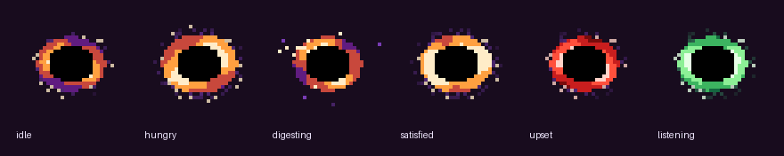

# Blackhole

<p align="center"></p>

**A tiny pixel-art black hole that eats your files and answers questions about them — entirely on your PC.**

Blackhole is a small always-on-top dot for Windows. Drop a PDF, a screenshot of text, a web page, a
receipt, a résumé, a pasted snippet — anything — onto it and it disappears into a local vault. Click the dot
and you can search everything you've ever fed it by *meaning*, not just by filename. Start a search with `?`
and a small language model answers from your own documents, citing what it read. Nothing leaves the
machine: no accounts, no cloud, no telemetry.

Issues and PRs are welcome — https://github.com/thowd22/Blackhole

---

## What it feels like

<p align="center"></p>

The dot is a 32×32 sprite drawn procedurally every frame — no image files, just a ring of hot pixels
around an event horizon, a purple accretion smear, and specks that orbit and fall in. It has six moods:

| | mood | when |
|---|---|---|
|  | **idle** | drifting at half speed, specks in slow orbit |
| | **hungry** | something is being dragged over it — the ring brightens and leans toward the cursor |
|  | **digesting** | swallowing a drop: the ring spins up, orange, and specks are pulled in one by one |
| | **satisfied** | a bright pulse when the item is indexed |
| | **upset** | a red flicker when a file couldn't be read |
|  | **listening** | green while the search panel is open |

- The dot floats above every window at whatever size you like. Drag it anywhere; **Ctrl+Shift+Space**
  summons it to your mouse and opens search; press again and it goes home.
- Drop files or selected text on it, or hit **Ctrl+Shift+V** to swallow whatever is on the clipboard. The ring
  speeds up and specks spiral in while it digests; it pulses when it's done, flickers red if it couldn't read
  something.
- Left-click: a dark panel appears beside the dot. Results update on every keystroke in about 5 ms —
  keyword matches and semantic matches fused, with a tag showing which kind of match you're looking at.
  **↵** opens the file, **Ctrl+↵** reveals it in Explorer, **Ctrl+C** copies a pasted note, **Del** forgets it.
- Type `? how much did shipping cost` and press ↵: a second box streams the answer, the results below show
  what it drew on, and the status line tells you which documents it read and how long it took. If none of
  your words appear anywhere in the vault it says so instead of inventing something.
- A pixel speech bubble walks you through this the first time you run it. The same bubbles carry
  notifications later; a right-click menu has sizes, tray options, start-at-sign-in and a "center on new
  message" toggle. There's a tray icon so the dot can hide.

## How it works

Everything below runs inside one 275 MB executable plus a 2.7 GB model folder. There is exactly one
inference engine in the whole app — **ONNX Runtime**, driven through **DirectML** so the same binary uses an
AMD, NVIDIA or Intel GPU, and the same models run on the Copilot+ NPU providers (Qualcomm QNN, AMD Ryzen AI,
Intel OpenVINO) when those land. The engine DLLs are compiled into the exe and unpacked beside it on first
run; nothing is linked at build time, so the app cross-compiles from Linux with plain MinGW.

### Swallowing

1. **Extraction.** Text and code files are read directly. PDFs go through a pure-Rust, *layout-aware*
   extractor (`src/pdf_layout.rs`): glyphs are re-assembled into rows and columns from their page positions,
   so a customs form comes out as `IMPORTING CARRIER | FROM PORT OF` over `TRANQUIL ACE | KOBE, JA` instead
   of stream-order soup, and fake-bold overprints are collapsed. Other files are indexed by name and metadata
   for now (OCR is on the roadmap).
2. **Chunking.** Each document is split into ~100-word chunks with a 20-word overlap, paragraph-aware, and
   line breaks survive inside a chunk — a résumé's job headers and a form's rows only mean something as lines
   (flattening them cost the model three answers in the eval).
3. **Embedding.** Every chunk — prefixed with its document's title — becomes a 384-dimensional vector from
   **bge-small-en-v1.5**, run on the GPU. One extra vector per document holds just the *title*: a
   whole-document handle that lets "which file has my career history" match `Resume.pdf` when no single
   chunk does. A new item is searchable a few seconds after you drop it.
4. **Storage.** Everything lives in one SQLite file in `%LOCALAPPDATA%\Blackhole`: the original text, an
   FTS5 full-text index, and the vectors. The vault is stamped with the embedding model's id; change the
   model and it re-embeds itself in the background.

### Searching

Live search fuses two rankers on every keystroke:

- **Keyword** (SQLite FTS5, BM25): typo-tolerant — terms are OR-ed with a prefix match on the last one, so a
  typo in one word doesn't empty the list, and a document matching more of your terms scores higher.
- **Semantic** (cosine over all chunk and title vectors, brute force — trivially fast at this scale).

They're fused by *score*, not rank: a strong semantic match contributes its normalised cosine, a keyword hit
contributes weight × (fraction of your terms it contains)², and distinctive terms (rare in *your* vault —
names, numbers, jargon, never English function words) add a small boost. This shape was chosen by
measurement: reciprocal-rank fusion looked great on the first question set and collapsed on a blind one.

An **absent gate** stops the two failure modes that make local assistants untrustworthy: if your query has two
or more content words and none of them occurs anywhere in the vault (and nothing matches strongly by
meaning), the panel shows nothing and ask mode never calls the model. Cosine thresholds couldn't do this —
unanswerable questions score as high as real ones — the lexical test could.

### Asking

`?` questions go through a heavier pipeline that's allowed ~250 ms before the model starts:

1. The question is expanded with synonyms — only ones that actually occur in your vault, so it never drifts
   toward things you don't have — and embedded.
2. The top candidates are re-scored by a **cross-encoder reranker** (mxbai-rerank-xsmall, int4), which reads
   query and passage *together* and decides the top document. On a blind question set this lifted top-1
   retrieval from 62 % to 73 %.
3. **Context assembly**: if the winning document is small enough (a résumé, a receipt) the model gets the
   *whole* thing; otherwise it gets the best chunks with their neighbours, in document order, up to ~1,400
   words. Questions about order or time get a forced `Timeline:` scratchpad — small models list dates
   correctly far more often than they reason about them in one shot.
4. **Generation**: **Qwen3-4B**, int4, on ONNX Runtime, entirely on the GPU — and it *thinks first*: the
   prompt opens a `<think>` block, the model reasons privately for up to 128 tokens (ordering dates, picking
   the right field of a form), then `</think>` is forced if it's still going and the answer streams. That
   short pass took correct answers from 70 % to 82 % on the blind sets; 256 or 512 tokens scored no
   better, so it stays short (~3 s). "Think before answering" in the right-click menu turns it off for
   ~2 s direct answers. The prompt pass
   (~1,300 tokens, about a second) runs on a dynamic-shape DirectML session; decoding runs on a second,
   *static-shape* session that DirectML compiles into a single fused operator, so each token is one dispatch
   (~9 ms, 100+ tok/s) instead of 400. Both share one fixed-capacity KV cache that never leaves the GPU;
   tokens stream into the panel as they're produced. The model is pre-loaded the moment you open
   the panel and unloaded 60 s after you close it, so RAM is only spent while you're actually asking.

The exact prompt of your last question is written to `%LOCALAPPDATA%\Blackhole\last_ask.txt`, and
`log.txt` records the retrieval trace, so "why did it say that?" is always answerable.

### The graph surgery that makes it possible

Off-the-shelf ONNX exports of chat models are not built for a desktop app on DirectML. Blackhole ships small,
weight-preserving graph tools (`tools/`) that turn a Hugging Face export into something that runs well:

| Problem in stock exports | Fix |
|---|---|
| The prompt pass returns logits for *every* position (~1 GB for a long prompt) | `last_logits.py` slices the last token before the LM head |
| The tied 1.5 GB embedding matrix is transposed at runtime on every pass | `gemm_head.py` swaps in `Gemm(transB)` |
| DirectML's GroupQueryAttention silently returns prompt-independent output when rotary is done inside the op | `explicit_rotary.py` moves rotary into explicit `RotaryEmbedding` nodes — the layout Microsoft's own DirectML exports use |
| The embedding/LM-head matrix is fp32 (1.5 GB, held twice) | `shrink_embeddings.py` streams it into an fp16 lookup and an int4 `MatMulNBits` head — −2.6 GB RAM, *faster* decode |
| The last-token `Slice` can't vary inside a fused DirectML graph | `logit_index.py` makes it a `Gather` on an int64 input, so the static decode session can be fused |
| Split, partly dead external data files | `repack.py` writes one file with only referenced weights |

Getting from 5 to 100+ tokens/s was not arithmetic: ONNX Runtime's profiler showed a decode step was 166 ms of
CPU-side dispatch for ~400 DirectML operators at ~0.4 ms each. Pinning every symbolic dimension
(`AddFreeDimensionOverrideByName`) lets DirectML fuse the whole decoder at load time. The dead ends
(padded steps corrupt GroupQueryAttention; graph capture, spinning and fp16 alone changed nothing) are
written down in [PACKAGING.md](PACKAGING.md#gpu-decode-2026-09-16-from-5-to-105-toks-on-the-same-engine).

Any instruct model dropped beside the exe works if its `tokenizer.json` sits next to it: the chat template
(ChatML, Llama 3, Phi, Gemma), stop tokens and fp16/fp32 cache layout are detected from the tokenizer and the
graph. The largest model in the exe folder or its subfolders is used.

### Measured, not guessed

Every retrieval and model decision in this repo was made against question sets over a real vault, with a
Python harness (`eval/harness.py`) that reproduces the app's math to cosine 1.0000, and an end-to-end
binary (`askeval`) that runs the actual pipeline and checks answers against regexes. The current numbers on a
**blind** 30-question set (written by an agent that saw only the vault):

| | Live search | Ask mode |
|---|---|---|
| Right document first | 62 % | **84 %** |
| Right document in top 3 | 92 % | 88 % |
| "Not in your vault" | 4/4, no false alarms | 6/6 |
| Correct answers, Qwen3-4B thinking | | **82 %** (36/44) |
| Correct answers, direct (no thinking) | | 66–70 % (Qwen3-4B 29/44, Llama 3.2 3B 31/44) |
| Latency | 5 ms | ~5 s to first text with thinking (~2 s without), ~50 tok/s |

The full story — what was tried, what won, what lost and why (bigger embedders lost; LLM chunk enrichment
lost; RRF lost out of sample; the reranker and title units won) — is in [RAG.md](RAG.md). Model selection,
the DirectML findings and the memory work are in [PACKAGING.md](PACKAGING.md).

### Why these choices

- **One engine, vendor-neutral.** ONNX Runtime + DirectML covers every consumer GPU from one binary, and the
  identical model files are what the NPU vendors ship. No CUDA, no llama.cpp, no per-vendor builds.
- **Small models, strong pipeline.** A 33M-parameter embedder plus a 22M reranker beat a bigger embedder
  alone in our tests, as the literature predicts. The 4B model with a short thinking budget was chosen over
  1.5B, 3B and 8B-class candidates on measured answers, speed and memory, not parameter count — and 128
  thinking tokens beat 512, measured.
- **Pixel art on purpose.** The dot is a procedurally rendered 32×32 sprite scaled with nearest-neighbour, drawn
  into a per-pixel-alpha layered window; the bubbles and panel match. It should feel like a desktop sticker,
  not an app.
- **Honest about limits.** A 4B model still misses a multi-hop question across two fields of a form, and
  colloquial questions with no word in common with a one-line note can't be retrieved. Those are the open
  items below; RAG.md records every step that was measured, including the ones that made things worse.

## Installing

Download `Blackhole-<version>-x64-setup.exe` (≈2.9 GB: app + ONNX Runtime/DirectML + Qwen3-4B) and run
it. Per-user install by default (no admin), optional start-at-sign-in and desktop shortcut. Your vault in
`%LOCALAPPDATA%\Blackhole` survives updates; uninstall asks before deleting it. Requires Windows 10 1903+ /
Windows 11 x64; any GPU with DirectML (the CPU is used otherwise, more slowly). While answering, the app uses
about 5.5 GB of RAM and ~6 GB of VRAM (weights are held by both GPU sessions); with no GPU it falls back to the
CPU for everything at a few tokens per second.

## Building (from WSL)

```sh
sudo apt install mingw-w64
rustup target add x86_64-pc-windows-gnu
# not committed (see PACKAGING.md for exact sources):
#   models/bge-small-en-v1.5/{model.onnx,vocab.txt}        BAAI/bge-small-en-v1.5
#   models/rerank-mxbai-int8/{model.onnx,tokenizer.json}  mixedbread-ai/mxbai-rerank-xsmall-v1 (onnx/model_quantized.onnx)
#   models/qwen2.5/tokenizer.json                         Qwen/Qwen2.5-1.5B-Instruct (built-in fallback tokenizer)
#   runtime/{onnxruntime.dll,DirectML.dll}                NuGet Microsoft.ML.OnnxRuntime.DirectML 1.20.1 / Microsoft.AI.DirectML 1.15.4
#   models/qwen3-4b/                                      onnx-community/Qwen3-4B-ONNX model_q4f16 → tools/ pipeline → repack
./build.sh             # cross-compiles and deploys over the installed app
./build-installer.sh   # stages exe + runtime + model and runs Inno Setup (winget install JRSoftware.InnoSetup)
cargo build --release --bin askeval   # end-to-end evaluation binary
```

`.cargo/config.toml` caps cargo at 4 jobs — the inference crates at opt-level 3 across 24 cores can exhaust a
15 GB WSL VM. SQLite is bundled; the app has no runtime dependencies beyond the GPU driver.

## Layout

| File | What |
|---|---|
| `src/main.rs` | Startup, ONNX Runtime bootstrap, message loop, ingest worker thread |
| `src/dot.rs` | The dot: rendering, drag, hotkeys, menu, moods, tutorial, notifications |
| `src/sprite.rs` | Procedural 32×32 pixel-art renderer |
| `src/bubble.rs` | Pixel-art speech bubbles |
| `src/search.rs` | Search panel: live results, ask box, keyboard handling |
| `src/tray.rs`, `src/startup.rs` | Tray icon; start-at-sign-in |
| `src/drop.rs` | OLE drop target and clipboard reading |
| `src/ingest.rs`, `src/chunk.rs` | Extraction, chunking, embedding on the worker thread |
| `src/store.rs` | SQLite + FTS5 vault, hybrid search, absent gate, context assembly |
| `src/embed.rs`, `src/rerank.rs`, `src/expand.rs` | Embedder, cross-encoder reranker, vault-anchored synonyms |
| `src/llm_ort.rs`, `src/ask.rs` | Model loading, chat templates, generation; the ask worker |
| `src/runtime.rs`, `src/gpu.rs` | Unpack/load ONNX Runtime + DirectML; pick the GPU with the most VRAM |
| `src/bin/askeval.rs`, `eval/harness.py` | End-to-end and retrieval evaluation |
| `tools/*.py` | Model preparation (last-token logits, Gemm head, explicit rotary, shrink, repack, GQA trim) |
| `installer/`, `build-installer.sh` | Inno Setup script, icon, model licences |
| `docs/art/` | The sprite rendered to PNG/GIF for this README (real output of `sprite.rs`, 4×/8× nearest-neighbour) |

## Roadmap

MCP server (`put` / `retrieve` / `notify`)
so agents can use the vault as memory → CI/CD → search-panel polish (auto-resize, on-theme scrollbars, rich
snippets) → OCR for images and scanned PDFs → Copilot+ NPU providers → code signing. Details and the
reasoning behind each in [FEATURES.md](FEATURES.md).

## Licence notes

Blackhole bundles Qwen3-4B (Alibaba Cloud, Apache-2.0), bge-small
(MIT), mxbai-rerank-xsmall (Apache-2.0) and ONNX Runtime + DirectML (Microsoft). See `installer/LICENSE-MODELS.txt`.
